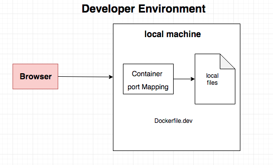
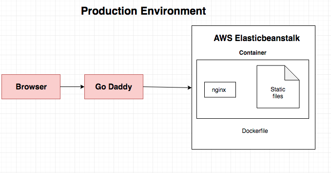
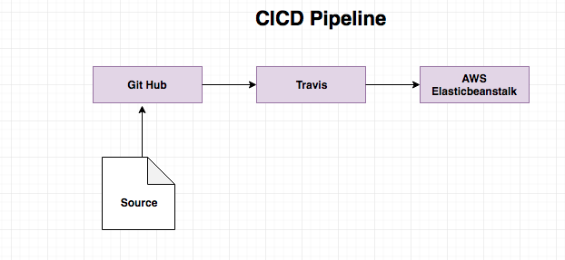

# Techfeedy

http://techfeed.info  
Pulls the trending topics from Hacker News, TechMeme, TechCrunch and Product Hunt

### Dev Env

Run -> docker-compose up  
url -> localhost:4200

To mimic prod  
docker build -t techfeedy .

### Prod Env

### Build Pipeline

